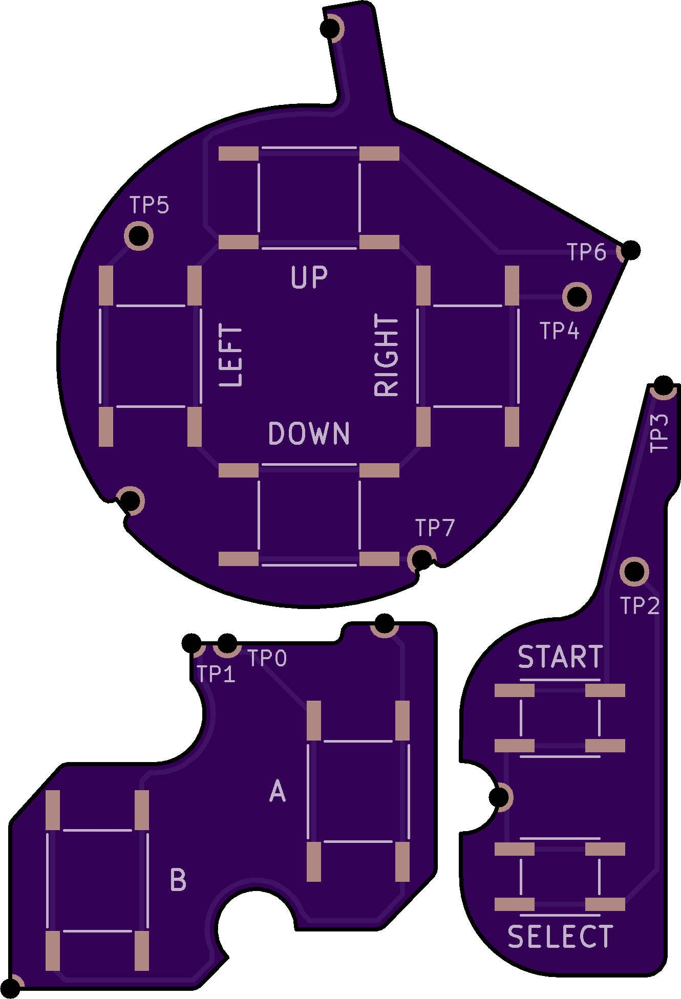

# Background

(WORK IN PROGRESS, STILL IN TESTING)

This mod for the Game Boy Advance (AGB) was inspired by makho's [AGB_TACT](https://github.com/makhowastaken/AGB_TACT) project which added tactile buttons to the AGB similar to those on the GBA SP.

Developed from the ground up, this implementation offers a no-wires-required solution, consisting of 2 (or 3) flex breakout boards for the DPAD, AB, and (optionally) START and SELECT.

# Mod Options and Compatibility

The tactile buttons are available in two different actuation forces (listed below) - 1.6N or 2.35N/2.6N - to suit your particular feel.

This mod is only compatible with AGB-001.

# Board and Parts Links

Flex board order link (Full button set) - [OSH Park](https://oshpark.com/shared_projects/VSVedxko)

Flex board order link (without START and SELECT) - [OSH Park](https://oshpark.com/shared_projects/1YE4jut3)

PTS526 SM08 SMTR2 LFS (for DPAD and AB - 1.6N actuation force) - [Digikey](https://www.digikey.ca/en/products/detail/c-k/PTS526-SM08-SMTR2-LFS/10056623)

PTS526 SK08 SMTR2 LFS (for DPAD and AB - 2.6N actuation force) - [Digikey](https://www.digikey.ca/en/products/detail/c-k/PTS526-SM08-SMTR2-LFS/10056623)

SOG-152ANT (for START and SELECT - 1.6N actuation force) - [Digikey](https://www.digikey.ca/en/products/detail/mitsumi-electric-company-ltd/SOG-152ANT/11591283)

SOG-154ANT (for START and SELECT - 2.35N actuation force) - [Digikey](https://www.digikey.ca/en/products/detail/mitsumi-electric-company-ltd/SOG-154ANT/11591258)

# Disclaimer

As with all hardware mods, you risk irreparable damage to your device if the proper precautions are not taken. Feel free to reach out for any questions or troubleshooting.

# Installation

TBD

# Acknowledgements

Thanks to [Makho](https://www.youtube.com/channel/UC5FYpo9lFqK1Y7wqjPuANFw) for his original project idea and video.

Thanks to [HDR](https://martinrefseth.com/) for compiling his Nintenfo repository, which made development much swifter.

# License

 This work is licensed under a <a rel="license" href="http://creativecommons.org/licenses/by-nc-sa/4.0/">Creative Commons Attribution-NonCommercial-ShareAlike 4.0 International License</a>.

Feel free to modify this design however you like, but please make sure to give credit where it is due. I encourage you to share your improvements with the rest of the Gameboy modding community at the Gameboy modding [Discord](https://discord.gg/RYN3bMxr) and [Subreddit](https://www.reddit.com/r/Gameboy/)

Under this license, you are not permitted to profit or commercialize this design in any part without my express permission.
