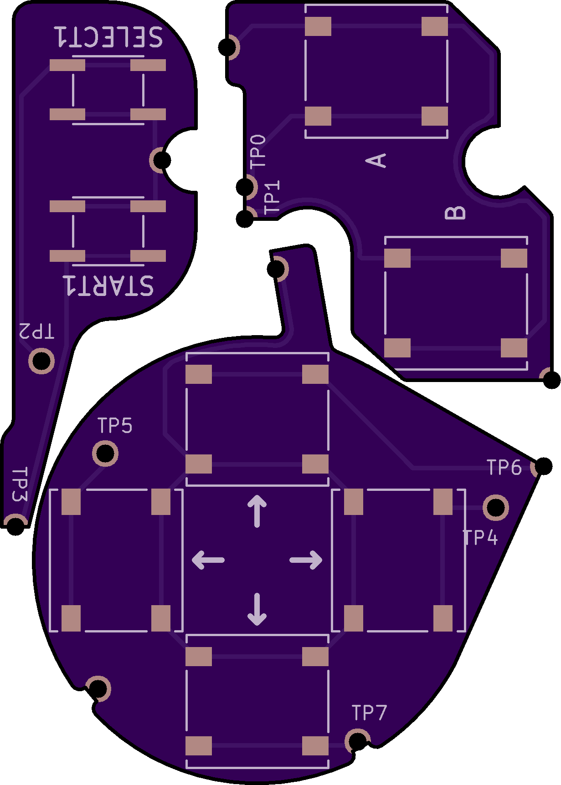

# Background

(WORK IN PROGRESS, STILL IN TESTING)

This mod for the Game Boy Advance (AGB) was inspired by makho's [AGB_TACT](https://github.com/makhowastaken/AGB_TACT) project which added tactile buttons to the AGB to create a similar clicky feel to the GBA SP and more recent Nintendo handhelds.

Developed from the ground up, this implementation offers a no-wires-required solution, consisting of 2 (or 3) flex breakout boards for the DPAD, A/B, and (optionally) START/SELECT.

# Mod Options and Compatibility

The tactile buttons are available in two different actuation forces (listed below) - 1.6N or 2.35N/2.6N - to suit your particular feel.

This mod is only compatible with AGB-001. 

Due to variability between OEM and different aftermarket buttons and membranes, some adjustments may need to be made to adjust the button height and travel distances - more details in the Installation section.

Compatibility with the IPS v2 mod's brightness controls is ensured - just solder the SELECT wire overtop of the TP2 hole.

# Board and Parts Links

Flex board order link (Full button set) - [OSH Park](https://oshpark.com/shared_projects/VSVedxko)

Flex board order link (without START/SELECT) - [OSH Park](https://oshpark.com/shared_projects/1YE4jut3)

PTS526 SM08 SMTR2 LFS (for DPAD and A/B - 1.6N actuation force) - [Digikey](https://www.digikey.ca/en/products/detail/c-k/PTS526-SM08-SMTR2-LFS/10056623)

PTS526 SK08 SMTR2 LFS (for DPAD and A/B - 2.6N actuation force) - [Digikey](https://www.digikey.ca/en/products/detail/c-k/PTS526-SM08-SMTR2-LFS/10056623)

SOG-152ANT (for START/SELECT - 1.6N actuation force) - [Digikey](https://www.digikey.ca/en/products/detail/mitsumi-electric-company-ltd/SOG-152ANT/11591283)

SOG-154ANT (for START/SELECT - 2.35N actuation force) - [Digikey](https://www.digikey.ca/en/products/detail/mitsumi-electric-company-ltd/SOG-154ANT/11591258)

# Disclaimer

As with all hardware mods, you risk irreparable damage to your device if the proper precautions are not taken. Due to variability in OEM and aftermarket  Feel free to reach out for any questions or troubleshooting.

# Installation

**General:**
* Solder PTS526 Sx08 SMTR2 LFS buttons to their corresponding footprints on the DPAD and A/B flex boards
* Solder SOG-15xANT buttons to their corresponding footprints on the START/SELECT flex board

**DPAD**
* Line up the holes labelled TP4, TP5, and TP7 with the corresponding testpoints on the AGB board, this should align all solder points with their corresponding contacts
* Solder:
  * TP4, TP5, TP6, and TP7 for each of the 4 DPAD buttons
  * Ground connection to the pad of the L button shielding
  * (Optional) VDD-15 can be used as an anchor point

**A/B**
* Line up the holes labelled TP0 and TP1 with the corresponding test points on the AGB board
* Solder:
  * TP0 and TP1 for A and B respectively
  * Ground connection to upper right GND pad
  * (Optional) FR2 can be used as an anchor point

**START/SELECT**
* Line up the holes labelled TP2 and TP3 with the correspoding test points on the AGB board
* Solder:
  * TP2 and TP3 for SELECT and START respectively
  * Ground connection to left GND pad
  * (For IPS v2 brightness controls) Solder the SELECT wire from the IPS ribbon cable overtop of the TP2 hole.

**Button height/travel**
* The button travel distance may need to be adjusted based on individual preference - simply insert some thin cardboard between the tactile buttons and membranes in order to shorten the travel distance 
* Cardboard may also need to be inserted under the center of the DPAD membrane in order to raise its pivot point - a properly functioning DPAD should only be able to register 2 directions at the same time - if you own a flash cart, you can check using this [ROM](https://github.com/heroldev/AGB-buttontest)

# Acknowledgements

Thanks to [makho](https://www.youtube.com/channel/UC5FYpo9lFqK1Y7wqjPuANFw) for his original project idea and video.

Thanks to [HDR](https://martinrefseth.com/) for compiling his Nintenfo repository, which made development much swifter.

# License

 This work is licensed under a <a rel="license" href="http://creativecommons.org/licenses/by-nc-sa/4.0/">Creative Commons Attribution-NonCommercial-ShareAlike 4.0 International License</a>.

Feel free to modify this design however you like, but please make sure to give credit where it is due. I encourage you to share your improvements with the rest of the Gameboy modding community at the Gameboy [Discord](https://discord.gg/RYN3bMxr) and [Subreddit](https://www.reddit.com/r/Gameboy/)

Under this license, you are not permitted to profit from or commercialize this design in any part without my express permission.
